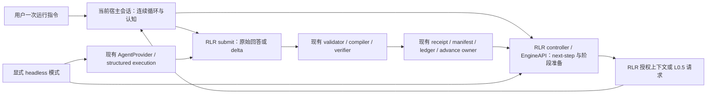

# RLR Agent-native Continuous Loop Design

## Goal

用户在当前 Codex App 或 Hermes 会话中说一次“运行 RLR”后，当前宿主 agent 持续执行获授权的 RLR loop，直到 RLR 的终态或停止条件。每次认知由这个宿主会话完成；RLR 继续决定 DAG 步骤、可见上下文、科学与契约校验、持久化、收据和状态迁移。正常节点自动衔接，无需用户逐节点转交提示词。

成功的运行在每个节点遵循同一顺序：`next-step → RLR 准备并交付授权上下文 → 宿主认知 → RLR 校验及提交 → RLR advance → next-step`。遇真实 blocker、高风险或不可逆操作所需批准、或协议指定的 human decision 时暂停。RLR 的终态自然结束循环；已有轮次上限与 StopPolicy 继续生效。

## Non-goals

- 不复制 DAG、状态机、科学 validator、Boolean compiler、EvidencePack、ledger 或 receipt 的权威实现。
- 不恢复旧版 `main_agent` 文档作为可执行协议，不把宿主会话包装成会启动模型进程的 `AgentProvider`。
- Agent-native 模式不为任何认知启动 `codex.CMD`、Claude CLI、其他 nested model subprocess，也不要求 API key 或 smoke-only model binding。普通确定性 CLI、Python/R 执行、受控 HTTP 检索可按节点契约使用。
- 不改变 P0/P1 的尝试预算、科学语义、Europe PMC source fidelity、`SemanticEvidenceVerifier` 的裁决逻辑、候选身份及 hash authority。
- 本 spec 不设计跨宿主进程消失后自动唤醒的调度器，也不要求 v2.0 旧项目迁移。

## Considered Approaches and Design Decision

| 方案 | 优点 | 代价与结论 |
| --- | --- | --- |
| 恢复历史会话提示词，宿主直接执行现有 CLI | 进入成本低；普通节点已有 `next-step` / `assemble-context` / `emit-delta` | 宿主会重复解释 `run_round` 的分支；当前 L0.5 一次性流程不能在宿主认知处安全暂停。拒绝。 |
| 在 `AgentProvider` 内挂起，等待宿主会话返回 | 普通节点复用 provider 调用形状 | Python 无法反向调用当前 Codex App/Hermes 会话；L0.5 planner、semantic assessor 也不经过该接口。拒绝。 |
| 扩展现有 RLR controller 与 EngineAPI，交付持久化的宿主请求并接收提交 | 复用唯一 DAG/state/validation owner；允许 L0.5 断点恢复；宿主持续驱动认知 | 需对当前一次性 acquisition 和 receipt 做有版本的窄扩展。采用。 |

内部可复用 owner 已核对：`src/run_loop.py`、`src/research_loop/api.py`、`src/research_loop/commands/ledger.py`、`src/research_loop/providers/base.py`、`src/research_loop/l05_curie/query_planner.py`、`src/research_loop/l05_curie/europepmc_runtime.py` 与 `src/research_loop/l05_curie/semantic_verifier.py`。历史 `docs/MAIN_AGENT_RUN.md` 证明宿主循环曾存在，但当时仍有外部 Deep Research 认知调用，不能直接满足本目标。外部源码参照：[LangGraph `interrupt` / `Command` 实现](https://github.com/langchain-ai/langgraph/blob/main/libs/langgraph/langgraph/types.py) 展示了持久化请求与恢复值的边界，也明确指出从节点开头恢复会重新执行逻辑。RLR 已有自己的 DAG 和 immutable artifact owner，因此借用“持久化请求、按 ID 恢复”的模式，不引入 LangGraph 或第二个框架；带外部副作用的 L0.5 必须从精确检查点继续。

## Architecture



宿主会话拥有循环的**继续执行动作**，不拥有下一节点选择。RLR 的 `next-step`、profile/topology、既有依赖门、静态闭合审计、上下文授权、`emit-delta` 和 advance/StopPolicy 是唯一状态权威。宿主只能消费 RLR 返回的当前待办请求，不能根据读到的仓库文件自行推断下一个节点或修改状态。headless 仍由 `run_loop.py` 执行，但它和宿主使用同一 RLR 状态投影及提交边界；二者只是认知执行者不同。

RLR 对宿主暴露一个窄的、可持久化的 `prepare / submit / continue` 交互面。实现时应扩展现有 controller/EngineAPI 和 L0.5 owner，不建立第二套 DAG runner。每个请求只描述一个经授权的动作，包含 request ID、项目/候选/轮次/节点、当前状态游标、输入 artifact 路径与 SHA-256、允许的工具与输出契约。RLR 在短暂锁内准备或提交；宿主思考期间不持有数据库或 acquisition 写锁。请求与提交采用不可变文件及精确 hash 绑定。

## Control Flow

宿主收到“运行 RLR”后保存本次目标项目、候选和可验证的宿主会话标识（若宿主提供），运行现有项目准备/依赖/静态闭合门，并进入以下协议。宿主仅在当前获授权的请求范围内使用工具和上下文。

```text
loop:
    step = RLR.next-step(project, candidate)
    if step is terminal: stop
    request = RLR.prepare-current-step(step)  # 含确定性前置步骤与恢复检查
    if request is already committed: RLR.continue/advance; continue
    if request is deterministic: RLR executes it through existing owner; continue
    if request requires cognition:
        host reads only the authorized request/context
        host produces one raw response artifact in the specified contract
        RLR.submit(request_id, raw_response_path)
        RLR validates, persists receipt and commits through existing owner
        RLR advances the declared state transition
    if RLR reports blocker / required human decision: stop and report
```

`prepare-current-step` 是现有 `run_round` 依赖、pre-research、L7、L9、L10c 分支的共享 controller 边界，不是另一套节点表。实际迁移必须使 headless 与 agent-native 消费同一节点决策与 advance 规则。宿主不能自己执行 `step.advance_command` 字符串解析；由 RLR 的同一 advance owner 执行。L9a/L9b 仍按 native v2.1 串行授权快照；L7 仍在受控 workspace 中执行获准脚本；L10c 仍经现有报告、同步和 StopPolicy owner。节点内需要的文献整理、预研究或 REVIEW 认知同样交付宿主，不能通过旧 `deep-research-run` / `run_text` 等路径暗中启动模型。检索、source verification 与代码执行是其原有确定性或外部数据工具，不因禁止 nested cognition 而禁用。

当前 L4/L8.5 的 `ensure_pre_research` 会调用 `deep-research-run`，它把文献认知与 evidence 持久化放在同一条命令中。Agent-native 必须在现有 `deep_research` / evidence owner 内把宿主需要做的文献判断拆成可提交的请求，把原有 evidence audit、source provenance 和 context 注入留给 RLR。普通预研究文本与 REVIEW 也必须以同样方式交接。若任何必达阶段尚没有这种交接能力，入口 capability gate 应在开始整轮前报告不支持，不能先运行若干节点后才暗中切换到外部模型。

## Agent-native Execution Contract

1. 普通认知节点的请求指向已持久化的 `ContextManifest/v2`、rendered context、persona/template 身份和输出 schema；L0.5 的专用请求则指向已持久化的 ResearchSeed、反馈或 `LOCATED` extract 及其 hash。宿主只把当前请求明确引用的 artifact 当作该步骤依据。先前节点在同一会话中的记忆不得作为新节点事实或隐式通信。
2. 宿主写出原始响应字节。RLR 在提交时重新验证 request ID、状态游标、context/seed/feedback hash、persona、工具策略和 response hash。与当前请求不匹配则 fail closed；不得通过复制、重序列化或伪造另一个 provider 输出绕过校验。
3. RLR 的既有 canonical delta、`emit-delta`、ledger commit 与 advance owner 完成状态变更。重复提交同一 request ID 与同一 response hash 返回已提交结果；同 ID 不同内容、旧游标提交或同节点并发写入报冲突。
4. agent-native 模式从入口到各子流程禁止启动模型 provider 进程。启动前的 capability gate 必须覆盖普通节点、L0.5、文献预研究、REVIEW 和 L7 文本认知。无法提供宿主交接的认知步骤必须停在该步骤，不能默默回退到 headless。
5. 连续性是宿主当前任务的执行契约：一次用户指令后，宿主自行循环直到 RLR 停止条件。若宿主应用、会话或任务被外部中断，磁盘上的 RLR 检查点支持下一次激活时恢复；本设计不承诺在完全没有可运行宿主时自行醒来。

## L0.5 Planner Handoff

`europepmc_runtime.py` 保持首轮 acquisition、attempt、coverage、manifest 和冻结的唯一 owner。当前 `propose_scientific_query_plan()` 把 prompt 构造、模型调用和科学校验串在一次调用中；agent-native 的准备阶段只冻结已授权 ResearchSeed、reformulation index、前一 validated plan、反馈、transport schema 与 prompt，生成不可变 planner request。宿主按该请求提出 `PLAN` 或获准的 `NO_ADMISSIBLE_REPLAN` 原始 proposal。提交阶段调用原有提案解析、`validate_scientific_query_plan()`、`_validated_v2()`、`compile_scientific_query_plan()` 及现有重规划候选/重复查询检查。RLR 继续注入和校验 `target_question_sha256`、`parent_plan_content_hash`、`feedback_sha256`、`feedback_gap_ids`、`plan_content_hash` 等 provenance/identity。

同一份 scientific schema 和业务 validator 服务 headless 与 agent-native，模型 transport 差异仅在提交来源。`NO_ADMISSIBLE_REPLAN` 的反馈前提和穷举判定不改变；若既有规则需要第二份提案，RLR 生成新的独立 request，宿主再认知，不在一次 submit 中暗自重试。只有 RLR 编译出的 QueryPlan 才进入检索，generated query 的 origin、content hash 与回执仍按现有路径形成。

## Semantic Verifier Handoff

Europe PMC 检索和 deterministic source fidelity 先产出 `LOCATED` extract。仅对这些 extract，RLR 以 exact extract hash、claim hash、候选/轮次/attempt 与 source snapshot 创建逐项 semantic request。宿主只返回 assessor 能负责的字段：`entailment`、`scope_match`、`context_preserved`、`qualification_preserved`、`reason`。提交由现有 `SemanticEvidenceVerifier.verify()` 使用该回答并生成 verdict、verification ID、assessor ID 和 contract hash；`admit_reasoning_evidence()` 决定可用于推理的证据。宿主不得提交 `source_fidelity`、`verdict`、`evidence_id`、`verification_id` 或 admission 结论作为权威字段。没有 `LOCATED` extract 时没有 assessor 请求，按现有空结果/coverage 语义继续。

## Receipt / Provenance

普通节点在现有 `RunReceipt` owner 内定义有版本的 host-session 变体，并让 `emit-delta` 的同一校验 owner 识别它。该变体必须绑定项目、候选、轮次、profile、节点、persona、request ID、context manifest/rendered context 的路径与 hash、原始宿主响应路径与 hash、canonical delta 的路径与 hash、代码/配置状态以及验证/提交结果。确有转换时记录原始到 canonical 的转换边。若宿主提供可核验的 session/task ID，记录其来源；模型名称或会话 ID 仅由宿主声明而无法核验时应标为声明值，不能写成 API 证明。`exit_code`、subprocess command/hash、API HTTP status 等无对应事件的字段留空或标记不适用，绝不伪造。现有 headless `RunReceipt/v1/v2` 的含义保留。

L0.5 planner provenance 在现有 acquisition manifest 中指向 planner request、原始 proposal、宿主提交 receipt、校验结果、compiled query 与其 hash。当前 `_validate_acquisition_manifest()` 要求 structured-execution receipt 的地方，应由**同一个** manifest validator 识别有版本的 host-session planner receipt，并对两种来源执行共同的身份/hash 不变量。Semantic request/response、`SemanticEvidenceVerifier` 结果、source snapshot、Europe PMC 请求/响应和 admitted/rejected evidence 也由同一 attempt/manifest 链接。不能把宿主结果伪装成 `structured_execution` 的 Codex receipt；EvidencePack 与候选/ledger 的既有身份和冻结 authority 继续有效。

## Recovery / Resume

RLR 持久化每个边界的当前阶段与不可变 artifact：`REQUEST_PREPARED → RESPONSE_RECORDED → VALIDATED → COMMITTED`。L0.5 在此基础上记录 attempt 内的 planner、query、retrieval/source、逐项 semantic、coverage 与最终 manifest 检查点。一次性 acquisition 必须扩展为可在这些边界返回和恢复的**同一个**状态机；当前“owner 存在而 terminal/checkpoint 不存在即报 incomplete”规则需被版本化的有效中间检查点取代。没有有效检查点的旧残留仍 fail closed。读入时逐项核验 owner、seed、feedback、request、response、attempt 和 source hash；不得扫描目录猜测最新状态。

恢复时先向 RLR 查询当前游标。已有完整 commit 只执行缺失的确定性 advance；已有回答而未完成校验只重跑确定性校验；已有 source snapshot 不重复检索；已有 semantic response 不再次要求宿主判断。相同请求与相同字节的重复提交返回原 receipt，内容不同时停止。写锁只包裹短暂状态检查与原子落盘，不跨宿主认知时间持有。若外部 HTTP 请求可能已发出但响应尚未可靠落盘，无法证明是否完成，记录不确定状态并暂停，要求协议指定的 human decision 后才允许新的请求；不得声称 exactly-once 的外部网络行为。

## Interaction with Existing Headless Mode

Agent-native 是用户在当前宿主会话中说“运行 RLR”时的明确模式。`run_loop.py run` 的现有 headless 自动化路径保留，但必须通过显式 headless 选择使用；配置不能把 agent-native 静默解释为 command/headless，也不能因宿主请求失败而自动转用外部模型。迁移期保留现有 headless receipt/manifest 的读取和恢复语义；同一个候选/轮次的活动 acquisition owner 只能绑定一种执行模式，切换模式需在新的、明确可验证的边界进行，不得混写同一未完成 request。v2.0 只读兼容代码不因此获得新写入能力。

## Authority Boundaries

| 责任 | 唯一 authority |
| --- | --- |
| 继续循环及生成认知内容 | 当前宿主会话；headless 时为显式 provider |
| DAG 下一步、依赖门、节点授权、StopPolicy、advance | RLR controller 与现有 profile/runner owner |
| ContextManifest、persona、ledger cursor 与节点可见性 | RLR context/ledger owner |
| L0.5 科学计划、反馈、Boolean query、provenance | `query_planner.py` 与现有 multisource adapter |
| 首轮 acquisition、尝试、HTTP/source snapshots、coverage、freeze | `europepmc_runtime.py` 及现有 P0 owner |
| source fidelity、semantic verdict、evidence admission | 现有 source verifier、`SemanticEvidenceVerifier` 与 admission policy |
| delta commit、RunReceipt、manifest、hash 与恢复 | 现有 ledger/receipt/acquisition owner |

同一宿主会话不能物理擦除先前 persona 的上下文。因此隔离契约是“仅以当前授权 artifact 作依据”，并通过输入 hash、节点范围、输出校验和 provenance 审计；不能宣称具有 headless fresh-session 的物理隔离。若某节点契约要求不可替代的物理新会话，agent-native 必须暂停，不能虚报满足。

## Compatibility

继续接受已经提交的 v2.1 delta、headless receipts、P0/P1 acquisition manifest 与 frozen EvidencePack；读取路径按明确版本分派。新增宿主 receipt 和中间 acquisition checkpoint 要版本化，在原校验 owner 中验证，不把旧 artifact 静默升级。现有 EngineAPI 与 CLI 命令仍可供 headless 使用；若为了共享阶段决策调整接口，调用者必须显式选择认知模式。`main_agent` 历史配置保持退休语义，不能作为隐式新模式别名。

## Migration Strategy

先提取 `run_round` 中已存在的阶段判定和 advance 映射为共享 RLR controller 服务，再接普通认知节点的宿主请求/提交；核实 receipt 与 ledger 原始字节绑定。随后在当前 P0 acquisition owner 内加入可恢复 planner 与 semantic 请求检查点，再覆盖文献预研究、REVIEW、L7 及轮末全部认知边界。最后让当前宿主收到一次“运行 RLR”即可持续调用该协议，并把 headless 设置为显式自动化选项。每一步均保持既有科学与持久化校验为最终裁决；旧路径只有在其所有调用者完成迁移且证据充分时才退役。

## Test Strategy

本设计阶段不运行测试。实施后的验证应包括：普通节点从 `next-step` 到 commit/advance 的真实 controller 边界；host receipt 与 headless receipt 的版本分派和精确字节/hash 校验；跨节点上下文注入与禁止未经授权输入的哨兵测试；L0.5 PLAN、合法 no-admissible-replan、反馈和 provenance；`LOCATED` 与非 `LOCATED` semantic handoff；retrieval/source/admission/manifest 一致性；中断发生在每个持久化边界后的恢复；重复提交同 hash 幂等、不同 hash 冲突；含显式 headless 的回归。必须用执行记录证明 agent-native 路径没有 nested model subprocess，并用一次另行授权的真实工作流验收外部边界；纯离线测试不能替代该证明。

## Stop Conditions

宿主循环只在 RLR 终态、真实 blocker、高风险或不可逆操作需授权、或协议指定 human decision 时结束或暂停。以下情况 fail closed 且不得继续后续节点：项目/候选/游标或 hash 不匹配；缺少有效授权上下文；同 ID 不同内容；receipt/manifest/ledger 冲突；L0.5 外部请求结果不确定；无法提供某认知步骤的宿主交接；或 agent-native 路径尝试启动 nested model subprocess。恢复前必须先检查 RLR 持久状态，不能以宿主记忆推断已提交动作。
