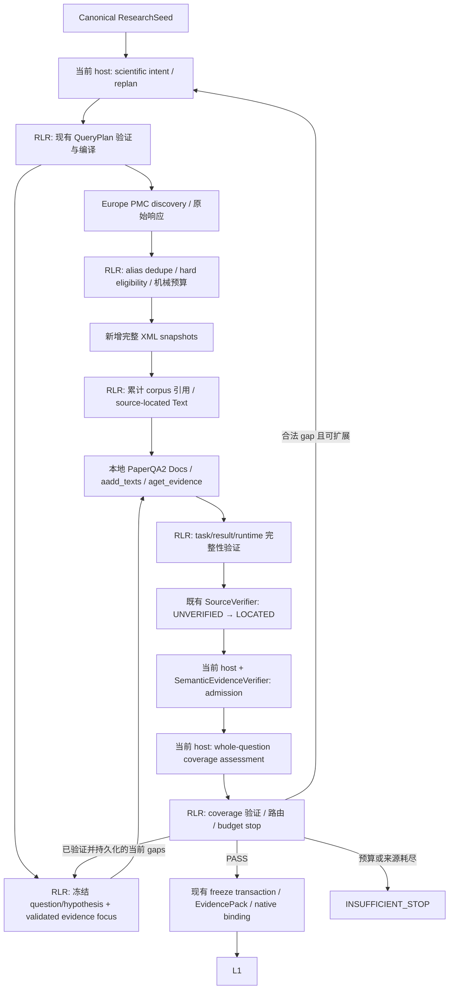

# RLR 本地 PaperQA2 cumulative corpus evidence worker — Architecture Spec

状态：**APPROVED**。版本：1.1。日期：2026-10-01。用户已明确批准本 architecture spec；1.0 的 `CHANGES_REQUESTED` 已由 1.1 的 validated evidence focus 与原生 Text source identity 修订处理。

本文件冻结已获批准的架构选择、接口和行为约束，不是 implementation plan，也不授权实施。本轮仅登记批准状态并修订既有计划文档；完成 self-review 后停止，不开始 Task 1、不修改生产代码、不运行科研检索或模型、不安装依赖、不 commit/push。

## 1. 目标、基线与适用范围

目标：在现有 L0 ResearchSeed → L0.5 acquisition → L1 边界内，RLR 调用本地 PaperQA2 对已授权的**累计语料**生成证据建议。保留 RLR 的来源验证、semantic admission、科学 coverage、状态、持久化与恢复权威，复用 PaperQA2 的完整专门计算系统，避免重建其检索、排序、摘要与 relevance 逻辑。

本 spec 基于：

- RLR HEAD `c60632afdb3aabd6e7c55ffea8dd6a43c50c7982`，分支 `review/l05-p1-final-diff`，仓库 `D:/research_loop/main`；本轮实时核对。
- 本地 PaperQA2 HEAD `57e89f7223b0960d5ee5ea048c69e3c47e088572`，tag `v2026.08.12`，包版本 2026.8.12；本轮核对 HEAD/tag 和干净工作区，版本及 import 初始化来自前轮验收。没有本轮模型调用。
- [2026-09-30 架构审核报告](../../../../reports/2026-09-30-paperqa2-corpus-architecture-review.md)，作为问题与证据目录；发生冲突时，以当前源码为准。
- 当前工作树 [AGENTS.md](../../../AGENTS.md) 的完整系统优先复用规则，以及 [External Reuse Gate](../../architecture/EXTERNAL_REUSE_GATE.md)。HEAD 中旧的治理文字不覆盖用户当前规则。
- [本轮 ExternalReuseAudit/v1](../../architecture/external-reuse/2026-10-01-l05-paperqa2-cumulative-corpus-design.json)，由现有工具校验；不是第二套 audit 格式。

本轮开始已有 `AGENTS.md`、`europepmc_runtime.py`、`selector.py`、`l05_curie_cli.py` 修改。三个生产文件的 diff 仅把默认论文预算从 3 改为 30；它们不是已实现的 corpus 接线。本设计不依赖这些未提交改动已通过验收，也不覆盖它们。

适用范围是 **native v2.1 的新 L0.5 acquisition run**。不改变候选状态 DAG，不增加新的 persona、服务、MCP、向量数据库、ledger 或工作流引擎。不把 L4B 的 frozen exact-source corpus 扩展为可搜索语料，不重构 L4、L8.5 或历史 v2.0 compatibility。后续 L1 gap retry 继续使用现有版本与授权 owner，不把首轮 acquisition attempts 当成 L1 retry rounds。

成功标准：唯一的 authoritative acquisition 路径能够表达完整 owner/dataflow；task/result 能校验输入与 runtime；累计语料、来源身份、coverage 和每一个恢复窗口有明确语义；软件故障不会伪装成科学 insufficiency；被替代路径有明确退出边界。

## 2. 架构选择与完整系统复用

| 方案 | 评价与结论 |
| --- | --- |
| **原生 Docs evidence worker + 边界适配** | 采用。一个进程内 Docs 接收整个累计 corpus，经 `aadd_texts()` 和 `aget_evidence()` 完成 embedding、retrieval、summary、relevance；RLR 只适配可核验输入、输出、诊断与生命周期。 |
| PaperQA2 autonomous agent / paper_search 直接处理整个研究循环 | 不采用。搜索和迭代规划由该 agent 接管，违反现有 RLR discovery/replan 与闭合 corpus 权威。这是具体 authority mismatch，不是代码风格偏好。 |
| 抽出 PaperQA2 的检索/模型部件，在 RLR 自建 ranking、summary、relevance 流水线 | 不采用。原生 Docs 已完整解决所需计算；拆分会复制成熟系统、扩大 RLR 的算法与恢复职责。现有 per-paper sparse bridge 也不满足 corpus relevance 目标。 |

`aadd_texts()` 是 PaperQA2 为预分块输入提供的原生 API。使用它仍然调用完整 evidence 系统。必须适配的事实是：原生 XML reader 不提供 RLR 要求的 JATS locator；RLR 已经拥有精确 XML snapshots、paragraph parser 与 SourceVerifier。只补齐这个输入边界，不能把“适配”扩展为本地 scientific selector。

来源：[固定提交 Docs API](https://github.com/Future-House/paper-qa/blob/57e89f7223b0960d5ee5ea048c69e3c47e088572/src/paperqa/docs.py)、[终止性 context 错误处理](https://github.com/Future-House/paper-qa/blob/57e89f7223b0960d5ee5ea048c69e3c47e088572/src/paperqa/core.py)、[tagged readers](https://github.com/Future-House/paper-qa/blob/v2026.08.12/src/paperqa/readers.py)。实际安装源码亦已读取；浏览器提取后的行号不作为本地源码行号。

## 3. 唯一 owner 与最终数据流

| 职责 | 唯一 owner / 边界 |
| --- | --- |
| 研究问题和 seed provenance | `research_seed.py`；从已验证 L0 contract 投影，不能使用 frontmatter 作为替代。 |
| 科学 discovery intent、gap replan | 当前 host，经 `query_planner.py` 现有结构化提出、验证、materialization、有限 replan 流程；不交给 PaperQA2。 |
| Worker retrieval question / evidence focus | 现有 acquisition owner 核验当前 coverage gap binding，`paperqa2_runtime.py` 确定性 materialize；冻结原始 question/hypothesis，PaperQA2 不能产生、改写或选择 focus。 |
| Discovery、标识符匹配、硬门、allocation | 现有 `multisource.py`、`selector.py`、Europe PMC discovery/transport 和 `europepmc_runtime.py`；只做机械准入和预算。 |
| 原始 XML、paragraph 定位 | `europepmc.py`；同一来源适配 owner，不新增 parser subsystem。 |
| Corpus evidence computation | 本地 PaperQA2；仅接收授权来源，所有模型输出是 proposal。 |
| Worker contract / subprocess / runtime | 现有 `paperqa2.py`、`paperqa2_runtime.py`、`scripts/paperqa2_rlr_bridge.py` 与 ProcessRunner；按新版本 corpus mode 适配。 |
| 独立 source fidelity | 既有 `EuropePmcEvidenceVerifier` / `verify_jats_candidates()`；独立重读 snapshot，才可发出 LOCATED。 |
| 科学 entailment、scope/context/qualification admission | 当前 host 提议，既有 `SemanticEvidenceVerifier` 验证并执行不可委托的 policy。 |
| 科学 coverage | 当前 host 提出 seed-bound assessment；`contracts.py` 校验，acquisition owner 路由及停止。 |
| Host 请求/回答 | 既有 `host_handoff.py`；`generate → validate → persist → receipt/hash → advance`。 |
| attempts、checkpoint、manifest、恢复 | `europepmc_runtime.py` 的现有 acquisition owner；无第二个 corpus ledger。 |
| EvidencePack / L1 admission | `store.py` 与 `l05_native_binding.py`；freeze transaction 和 native binding 保持唯一。 |
| 外层 DAG | `src/run_loop.py`；`host-next` / `host-submit` 接线不变成新编排框架。 |

PaperQA2 不写 RLR checkpoint、EvidencePack、candidate/hypothesis state，不判断 coverage，不发出下一轮 query，不执行研究分析代码。Embedding 与 summary 模型可使用现有模型服务；“本地 worker”表示本地进程，不能理解成模型必然离线。

## 4. 运行绑定、模型 Settings 与预算

继续使用项目 `00_Preflight/deep_research_runtime.json` 的 `paperqa2` binding，由现有 deep_research / lifecycle / preflight owner 读取与维护。保留 `python_executable`、`bridge_script`、`paperqa_repo`、`pqa_home`、`timeout_seconds`。增加显式 `worker_mode = corpus-evidence-v1`、非敏感 `settings` 及 `acquisition_budget`，不建立另一套配置入口。

运行时先冻结本 run 的有效配置引用及 SHA-256。后续 continuation 使用冻结配置；项目设置、模型别名或源码身份变化不能静默替换本 run 的输入。新配置只用于新 run。凭据仍由现有运行环境提供，不进入 task、Settings artifact 或哈希展示。有效配置必须显式给出 embedding 与 summary 模型及影响输出的非敏感配置，不依赖可变化的隐式模型默认值。

固定 worker mode 的行为约束：

- `answer.evidence_retrieval = true`，`evidence_skip_summary = false`，`evidence_text_only_fallback = false`。
- `parsing.use_doc_details = false`，`multimodal = false`，`doc_filters` 为空；不做 metadata lookup、citation generation 或隐藏的文档淘汰。
- 使用原生 Settings 和原生 MMR；首版保持 `texts_index_mmr_lambda = 1.0`，不把它描述为已启用多样性惩罚。
- `max_concurrent_requests = 4`；允许 binding 显式降低，不高于 4。没有 RLR 自建 summary concurrency scheduler。
- `aadd_texts` 可使用原生 deferred embedding；冻结配置必须记录该设置。整个 worker 只有一次 `aget_evidence`，不能先重复运行 retrieval/MMR，也不调用 `aquery` 或 answer-generation/agent/search API。
- 每次新 acquisition attempt 构建新的进程内 Docs/PQASession。累计性来自 RLR 的 corpus 输入；不从 PQA_HOME、历史索引或前一 session 隐式加载文献。

| 参数 | 首版默认与规则 |
| --- | --- |
| `max_acquisition_attempts` | 3；可设置 1–3。与现有 planner reformulation 0–2、manifest 和 contracts 的硬上限一致。 |
| `new_papers_per_attempt` | 30；每轮新增成功纳入 corpus 的论文上限。 |
| `cumulative_paper_limit` | 90；用户已明确确认每轮 30、累计 90。可降低；任何配置不能超过 90 或绕过 attempt 上限。 |
| `evidence_k` | 60；独立的 Text 检索预算，可显式设置正整数，冻结入 task；不按论文数解释，不保证逐篇审阅。 |
| `timeout_seconds` | 复用既有 binding 的显式正数；没有自动延长或额外无上限重试。 |
| discovery `page_size` | 保持现有 25；首版不新增自动 pagination。跨 query 的真实唯一候选不足 30 时允许少于 30。 |

60 是可审核的资源默认值，不是质量已验证的阈值。最多三轮意味着最多三次 corpus worker 调用，但每次原生内部的 embedding/summary 调用数量由输入和 evidence_k 决定。成本、timeout 和 90 篇内存表现必须在后续授权验收中测量。

## 5. Corpus 准入、累计与来源定位

### 5.1 机械 allocation

仅接受现有 Europe PMC 硬门：有 PMCID、OA 为真、可经 Europe PMC 获取 XML；保留现有来源类型规则。不得由 relevance、词项相似度或预算压力放宽硬门。

先复用 canonical stable-identifier / alias dedupe，再按已冻结 QueryPlan 的 query 顺序 round-robin 分配；每个 batch 使用其原始 provider 结果顺序，以 canonical paper_id 作剩余并列项稳定排序。一个 paper 在 allocation 中只出现一次，全部 query/provider provenance 保留。原始结果顺序只作为机械资源分配规则，不作为 scientific relevance 证据。`_europepmc_selector_score` / `_ranking` 的 scientific lexical 分数退出该路径。

候选进入本轮前，与累计 corpus 的 DOI/PMID/PMCID aliases 匹配；已纳入来源不再次抓取。记录已知资源失败的 aliases；同一 run 不对相同失败资源重复发起获取。跨轮 identifier enrichment 不能改变既有 paper_id。出现同一 alias 指向不同既有 canonical 身份，或同一 paper_id 绑定不同 snapshot，均为 integrity error，不能静默合并。

Allocation 不通过“constant scientific score”伪装为旧 scorer。复用现有 eligibility / provenance owner，在其边界增加明确的 mechanical allocation 方式，供新的唯一 acquisition 路径使用。

### 5.2 累计 invariants

令 `C_i` 为 attempt i 执行 worker 前的成功 corpus：

`C_i = C_(i-1) ∪ N_i`，`N_i ∩ C_(i-1) = ∅`，`|N_i| ≤ 30`，`|C_i| ≤ 90`。

首轮可从空集合开始。后续 worker 调用必须有 `|N_i| > 0`；无新增来源时不重复执行相同 corpus 的模型调用，而是明确停止为 insufficiency。每轮读取整个 `C_i`，不能只给 worker 新论文，也不能删除没有被本轮检索命中的旧论文。

Corpus 顺序是首次成功纳入顺序；旧元素和其原始 snapshot 引用保持不变，新元素追加。所有 snapshot 留存完整 XML 原始 bytes/hash，不因 admission 或模型 score 变化重抓、重写或换版本。Corpus manifest 只是 attempt manifest 中的有序引用，不另建可写 corpus registry。

已知单篇 HTTP 404/410 或合法 XML 无可用 paragraph 可以从本轮剩余机械 reserve 补位；保存失败理由和原始来源。Malformed XML、身份/hash 错误、服务级故障不以换论文隐藏。所谓 30 是成功 corpus 准入预算，不是必须获取到的数量，也不是无限 reserve 重试：只遍历本轮已发现的有限候选集合。

### 5.3 文本输入与 parser version

RLR 从原 snapshot 生成 PaperQA2 原生 `Text` 输入。读取范围为 abstract 及 body 中可定位的非空 JATS `p`，包含 Methods、Results、Discussion 和 body 内含 `p` 的 captions；不按 R/D/C 预过滤。References、作者信息和未授权附件不进入输入。非 paragraph 的表格单元、公式、多模态内容不承诺被完整读取；这项材料范围限制进入 coverage request，不能宣称“所有全文内容已审阅”。

复用 `parse_jats_paragraphs` owner，定义 parser profile `jats-paragraphs/v2`：

1. 按 XML paragraph **节点身份**消除嵌套 sec 重复；不得因文字相同而删除不同位置的段落。
2. 对已有 sec paragraph，继续使用当前 `sec:<index>/p:<index>` 计算规则；一个 paragraph 在多个祖先 sec 被枚举时选最深 sec 的既有 locator。section 取该 sec 的直接 title 或既有 Untitled 表示。
3. 对没有 sec ancestor 的 abstract/body paragraph，使用新增命名空间 `jats:v2/abstract:<ordinal>/p:<ordinal>` 或 `jats:v2/body/p:<document-order-ordinal>`；ordinal 来自完整 snapshot 的确定性 document order，不能来自过滤后的列表。
4. 采用现有 `_element_text` / `_normalize_text` 的文本规范化；transport 严格 UTF-8。无效 Unicode 不可悄悄省略、替换或当作“不相关”。
5. verifier 在相同 owner 内按声明 parser profile 独立重建 locator map。旧数据的全部既有 sec locator 仍可验证；新增 source units 只发出 canonical locator。parser profile 固定在 task、输入完整性与 source extract 中。

单个 Text 对应一个完整 source paragraph，不跨段自动拼接或以 LLM 摘要替换原文。超长 paragraph 不静默截断；若模型/API 无法处理，按 worker failure 处理，后续改变分段方案必须重新审核定位契约。

## 6. 最终 worker 接口

以下是规范性 wire 字段；不是生产实现代码。唯一 contract validator 归 `paperqa2.py`，运行边界和 provenance 归 `paperqa2_runtime.py`。bridge 做必要的输入防护和原生类型适配，不引入另一套 RLR validator registry。

### 6.1 `PaperQA2CorpusTask/v1`

| 字段 | 类型 / 约束 |
| --- | --- |
| `schema_version` | 固定 `PaperQA2CorpusTask/v1`。 |
| `task_id` | 内容绑定的 invocation 身份，由 RLR 生成，包含 acquisition run/attempt slot，不能复用为新的执行。 |
| `research_seed_sha256` | canonical seed hash，64 位 SHA-256。 |
| `question` | 非空 UTF-8；由 RLR 确定性组装为完整冻结 Scientific question、Hypothesis to evaluate，加本 attempt 的 validated evidence focus（若非 null）。不按单篇 title 改写或截断。 |
| `evidence_focus` | wire 字段必须显式为 null 或下述对象；首轮必须 null，attempt 2+ 可为 null。非 null 仅引用触发本 attempt replan 的当前 validated coverage gaps，不接受其他来源。 |
| `parser_profile` | 固定 `jats-paragraphs/v2`。 |
| `settings_sha256` | 本 run 冻结的有效非敏感 Settings hash。 |
| `corpus` | 有序且非空的文档列表，唯一 paper_id，累计不超过 budget。 |
| `corpus[].paper_id` / `title` | canonical ID / 已发现标题；标题仅提供 citation，不发起生成或 enrichment。 |
| `corpus[].document_path` / `document_sha256` / `media_type` | 项目根内原始 snapshot 相对路径/hash；首版只允许 `application/xml`。 |
| `corpus[].source_units` | 非空列表；每项只有 `source_locator`、`section`、`source_text` 三个非空字符串。同篇 locator 唯一。 |
| `budget.evidence_k` | 正整数，必须等于冻结有效 Settings 中的 evidence_k。 |

`source_units` 内联于现有 worker task artifact：这是前轮概念接口增加的明确输入适配字段，避免在 PaperQA2 环境内复制或导入另一套 JATS parser，也避免跨环境依赖 RLR Python 包。XML 原件仍是 source authority，source_units 不具有 LOCATED 状态；完整原文不写进状态 delta。DOI/PMCID/query lineage、allocation budget 和 attempt_index 留在现有 acquisition artifacts，由 task ref 关联，不复制另一套论文 registry。

**永久冻结的 base question / semantic claim** 为 `Scientific question:\n{seed.scientific_question}\n\nHypothesis to evaluate:\n{seed.hypothesis_seed}`，只使用 canonical seed 原始字段。该字符串及其 claim hash 在所有 attempts 中保持一致；focus 不进入 SemanticVerifier claim，也不改变 hypothesis 或 coverage 所评估的完整科学问题。

非 null `evidence_focus` 对象只有 `coverage_request_sha256`、`coverage_assessment_sha256`、`gaps`：前两项分别绑定当前有效 coverage request 与其已验证、持久化 assessment 的 canonical artifact hash；`gaps` 是该 assessment 的全部未解决 evidence gaps，按唯一 `gap_id` 升序复制，沿用既有 `gap_id`、`topic`、`reason`、`search_directions` 结构，字段内容及 search_directions 顺序不改写。列表必须非空，不能加入 planner 新造的 focus、自由文本摘要或另一套 gap schema。这里的“当前”指同一 run 中触发本 attempt replan 的最近有效 coverage assessment（通常为前一 attempt 的结果），不是尚未产生的本 attempt worker 后 coverage request；复用 assessment 时保留其原 request/hash 和 origin receipt。过期或其他 run 的 gaps、未验证/未持久化回答均不可使用。

RLR acquisition owner 在冻结 task 前核验 request/assessment/receipt hashes、run/attempt lineage、gap membership 与当前有效 binding；attempt 2+ 明确采用 null 或上述完整 gap 投影并持久化，之后不再选择或修改。非 null 时 worker `question` 精确等于 base question 加 `\n\nEvidence focus:\n{canonical_json(evidence_focus.gaps)}`；canonical_json 使用第 6.3 节规则。null 时精确等于 base question，首轮无 focus 后缀。Worker question 的换行、原始内容与 focus 对象均进入 task hash，不做截断、模型改写或按论文筛选 focus。PaperQA2 仅消费这个 question 进行累计 corpus retrieval，不产生、修改、选择 focus，也不把它作为新的 scientific claim。

非敏感有效 Settings 作为既有 subprocess invocation envelope 的冻结运行参数传递，hash 必须与 task 相同。Operational repo/interpreter/PQA_HOME 路径来自既有 binding；bridge 不通过 task 指定替代 interpreter 或执行脚本。

RLR 在 dispatch 前独立重读 XML、重算 document hashes 和 source_units 一致性，并重验 focus provenance 与 question materialization。bridge 使用受控项目根解析 document_path 并再次校验 bytes/hash；不从 task 路径读取其他 corpus。

原生 source identity 映射固定为：`Doc.dockey = canonical paper_id`，`Doc.docname = canonical paper_id`，`Doc.citation = title`；每个 Text 关联该 Doc，`Text.text = source_unit.source_text`。利用原生 Text 允许的扩展字段，显式设置 `Text.source_locator = source_unit.source_locator`、`Text.section = source_unit.section`，两者为非空、可哈希字符串，原样保存 canonical RLR JATS location 与 section。`Text.name` 只须在输入内唯一，不能作为定位权威或解析回 locator。不得新增另一套 locator、用笼统 metadata 容器替代这两个字段，或从生成 summary 重建 location。`aadd_texts` 意外返回 False、Doc/Text 数量不符或额外 corpus 被加载均为失败，不能继续空执行。

### 6.2 `PaperQA2CorpusResult/v1`

| 字段 | 类型 / 约束 |
| --- | --- |
| `schema_version` | 固定 `PaperQA2CorpusResult/v1`。 |
| `task_id` / `task_sha256` | 精确回显调用 task 身份和 canonical JSON bytes hash。 |
| `runtime.package` / `version` | `paper-qa` / 精确绑定版本。 |
| `runtime.upstream_commit` / `upstream_tag` | 精确源码绑定；同时核对安装模块来自已绑定 checkout，dirty source 不可冒充 pinned runtime。 |
| `runtime.embedding_model` / `summary_llm_model` | 与冻结有效 Settings 一致的实际请求模型。 |
| `runtime.settings_sha256` | 与 task 和 invocation 一致。 |
| `execution.status` | 只有成功结果允许 `COMPLETE`。失败经现有 process/error receipt，不返回伪成功 result。 |
| `execution.ingested_paper_count` / `ingested_text_count` | 与 task corpus/source_units 精确一致。 |
| `execution.terminal_context_error_count` | 必须为整数 0，且诊断 capture 在本次调用全程有效。 |
| `evidence` | 可为空；最多 evidence_k 项。 |
| `evidence[].paper_id` / `source_locator` / `source_text` | 属于 task 原生 Text；原文来自 `Context.text.text`，不得使用生成 context 摘要。 |
| `evidence[].relevance_score` | 0–10 范围整数，bool 非整数；aget_evidence 保留的输出应 > 0。超范围或非法值为结果 contract failure。 |
| `evidence[].contextual_summary` | 可选生成字符串，仅供 audit；不进入 source extract、admission claim 或 coverage 的事实输入。 |

Result 不携带 verification_status、scientific role、coverage verdict、next query、candidate status 或 pack write instruction。超出契约的 authority 字段拒绝，不通过通用 extra 字段偷偷接受。Section 由已冻结 source unit 映射，不能由生成模型重命名。原生 Context.id、Doc content MD5 不成为 durable evidence ID 或 source hash。

校验层次明确分开：envelope 校验 schema、runtime、task binding、计数、分值和 paper membership；未知 paper_id 是整次 contract failure。已知 paper 的 locator/text fidelity 交给既有 SourceVerifier 按条核验，按第 10 节区分局部 proposal rejection 与系统性错配。

Bridge 直接读取 `PQASession.contexts`，不调用会删掉 Text 的展示过滤函数。返回 `paper_id` 从 `Context.text.doc.dockey` 读取，`source_locator` 从 `Context.text.source_locator` 读取，原文从 `Context.text.text` 读取；同时核验 `Context.text.section` 与 task 对应 source unit 一致，不解析 Text.name、不新造 locator。按 `(paper_id, source_locator)` 排序消除原生 set 顺序差异；同一 locator 的完全相同结果去重，冲突重复项拒绝，不写一套“择优排序”。relevance_score 是检索诊断，不是 admission/coverage threshold。

### 6.3 规范化、持久化与权限

沿用 acquisition 现有 canonical JSON 规则：UTF-8、`ensure_ascii=False`、键排序、紧凑 separators，禁止 NaN/Infinity 和重复 JSON key；数组顺序是契约的一部分。task/result 的文件 SHA-256 与重新规范化后的 hash 必须一致。task_id 的 identity hash 计算排除 task_id 本身；task_sha256 计算包含 task_id 的完整 task bytes，避免循环定义。

`evidence_focus`（包括显式 null、coverage request/assessment hashes 与有序 gaps）及完整 materialized question 同时参与 task_id 的 identity hash 和完整 task_sha256。换 focus、gap 内容、coverage binding 或 question 必须得到不同 task 身份/hash；即使 corpus 相同也不能复用另一 focus 的 result。草案尚未实现，Task/v1 名称保持；缺失 evidence_focus 的旧草案 task 不隐式补 null 或升级后用于此契约。

Task 写入后不可修改。捕获 stdout/stderr 和原始返回值是诊断证据；只有 `result schema → task/runtime/input binding → source/admission` 各边界的验证通过后才写相应 authoritative artifacts。不得因 stderr 非空就失败，也不得以 exit 0 即认为输出已验证。

现有 `ProcessRunner` 的内存 stdout 默认上限为 256 KiB，60 条完整 paragraph 可能超过它。复用其 `observer.on_stdout/on_stderr` 流式保存本次原始输出，完成后验证文件完整性，从完整 stdout artifact 解析 JSON；不得从截断的 `ProcessResult.stdout` 解析后报告 empty contexts，也不重写进程执行器。日志写入/observer 错误为 PERSISTENCE_ERROR。ProcessResult 的 truncation flags/byte counts 进入 completion 诊断；内存截断在完整文件已保存时不是科学失败。

## 7. Source evidence 与 attempt proposal 分离

Result 按 paper_id 转为 UNVERIFIED candidate，RLR 从 task source_units 恢复 section/locator，再调用已有 SourceVerifier。不得先把 source_units 标为 LOCATED，也不得允许 generated summary 替代 source_text。

稳定 source extract 继续使用现有 `L05EvidenceExtract/v1` 和当前 evidence_id 公式：paper_id、locator、规范化原文和 snapshot SHA-256 决定 ID。其 retrieval 只包含固定来源、独立 verifier/parser profile 和原始 snapshot 引用；不嵌入每轮变化的 summary、score、worker result hash、当前 attempt 或 Settings。

Worker task/result/runtime/score/summary 位于 attempt 的 worker proposal/receipt 引用中，经 `(evidence_id, task_id, task_sha256, result_sha256)` 关联。首次定位后保存一个 canonical extract；之后出现同一 ID 必须得到完全相同 canonical bytes。来源或 parser 已变化不能覆盖既有 extract，截短 ID 碰撞仍须 fail closed。

Semantic verification 继续绑定 exact extract hash、完整固定 claim hash、现有 semantic contract hash 和 assessor。RLR 的 claim 只使用第 6.1 节永久冻结的 base question；不直接使用可能附带 evidence focus 的 worker question，不因 replan/focus 改变。输出只含现有五个 assessor 字段；SUPPORTED/CONTRADICTED 且三个 preservation 条件为真才 admission。UNRELATED、AMBIGUOUS 不进入 pack，但原始 assessment/拒绝理由保留。

首版 source extract 的 role 固定为 CONTEXT；CONTRADICTED 通过现有 semantic entailment 保留为反证，不让 PaperQA2 生成 SUPPORTING/CONTRADICTORY role。相同 source ID 的 role 不能随重跑改变并造成全对象碰撞。

已经完成的相同 extract/claim/contract/assessor semantic verification 直接重放，并保留 origin attempt 的 host request/receipt。新的 attempt 只引用既有验证，不伪造新 host 回答。任一绑定变化不能复用；本 run 的 claim/contract 冻结，不允许通过配置更新改变语义。

Cumulative admitted set 是所有已通过 admission 的稳定 evidence 并集。本轮 worker 未再次返回旧 evidence，不撤销它的 admission。新结果无证据也不得清空旧 evidence；coverage 始终看到 cumulative admitted set。

## 8. 科学 coverage 与停止语义

### 8.1 Host assessment 的输入和输出

停用新路径的 `_coverage_for` 中“有 snapshot + 有 Results/Discussion 就充分”的科学充分性规则。复用当前 host handoff，新增 `coverage:<attempt_index>` stage；persona 是同一个当前 host 的 L0.5 coverage assessor，不引入独立 agent 或状态 authority。

Coverage request 由 RLR 冻结并 hash-bind：seed、永久冻结的 base question/claim、attempt identity、有序 cumulative corpus snapshot refs、canonical admitted extracts 与 semantic verifications、ingestion scope limitations、已验证前轮 gaps，以及剩余预算事实。Worker evidence focus 只影响 retrieval，不取代完整问题、缩减 coverage dimensions 或转移 coverage authority。输入不得包含 unadmitted model proposals，也不能把 contextual_summary 作为 scientific evidence。Host 不自行搜索或读取授权上下文外的材料。

在现有 `contracts.py` 内定义 `L05ScientificCoverageAssessment/v1`，供此 handoff 使用；唯一 validator 同时供 submit 与 replay 调用。字段为 `schema_version`、`request_sha256`、`dimensions`、`gaps`。它不是另一个 CoverageDecision。

`dimensions` 必须且只能包含两个 seed-derived 维度：

- `SCIENTIFIC_QUESTION`：已获准证据是否覆盖完整科学问题及其关键范围，而非仅有相似词项或某个段落。
- `HYPOTHESIS_EVALUABILITY`：证据是否足以对原 hypothesis 作有范围、有条件的支持/反证评估；充分不要求支持 hypothesis。

每个维度含 `dimension_id`、`sufficient` boolean、非空 `reason`、去重的 `admitted_evidence_ids`。sufficient 为真必须引用至少一条累计获准证据；引用需属于本 request。false 必须对应至少一个 gap，不能通过跳过维度实现 PASS。

`gaps` 复用既有 gap 结构并要求唯一 ID；topic 指明对应 dimension，reason 明确缺失证据/范围，search_directions 为具体但不放宽硬门的搜索方向。空 cumulative evidence 必须至少有一个 gap。材料范围限制若影响问题可评估性，必须留为 gap；未检索到某篇/未覆盖全部 paragraph 本身不自动成为问题 gap，也不能被表述成“证据不存在”。

RLR 验证 schema、request/hash、维度全集、evidence membership、sufficient/gap 一致性及 evidence 非空条件，**不宣称机械 validator 能证明 host 的科学判断正确**。Host 的 coverage 判断和引用理由留存为可审核 cognitive receipt。

只有经过这些验证、已持久化并与当前 coverage request/receipt 绑定的 gaps，才可按第 6.1 节成为下一 attempt 的 evidence_focus；不得从原始 host 回答或 PaperQA2 输出直接取 focus。Discovery replan 继续使用现有 planner；worker focus 是同一已验证 gaps 的确定性投影，不增加 focus cognition stage 或新的决策 owner。

### 8.2 Routing 与 version 边界

继续调用既有 `judge_coverage` 和 `validate_coverage_decision`，产出 `L05CoverageDecision/v1`：covered 为 sufficient dimension IDs，gaps 为验证后的 gap 列表。没有 gaps 才 PASS；有 gap 且剩余 attempt/corpus 预算允许扩展才 INSUFFICIENT_RETRY，否则 INSUFFICIENT_STOP。

CoverageDecision 的 `round_index` 继续表示 EvidencePack version：首轮 acquisition 的所有 attempts 均为 1。`attempt_index` 单独存在于 manifest/checkpoint/host identity，不能令第 3 attempt 冻结 EvidencePack v3。当前 judge_coverage 的 round_index/max_rounds 不能单独判断 attempt 预算；不得通过伪造 round_index 或 max_rounds 绕过 store validator。

正式 routing 接口是在既有 `judge_coverage` 增加显式、可选的 `acquisition_state` 输入，字段固定为 `attempt_index`、`max_attempts`、`corpus_count`、`corpus_limit`、`terminal_reason`。首轮新 mode 必须提供；acquisition owner 提供已核验事实，contracts owner 唯一计算 verdict，caller 不散落改写。terminal_reason 只允许 null、no_admissible_replan、no_new_sources、attempt_budget_exhausted、corpus_budget_exhausted，并需与对应 planner/discovery/budget 事实匹配。有 gap 且任何终止条件成立即 STOP；没有 gap 时，非空获准证据可 PASS，即使预算恰好用尽。CoverageDecision v1 的 round_index/max_rounds 和 wire 字段保持原义；未传该输入的 legacy 路径保持原有 pack-round routing。

| 条件 | 路由 |
| --- | --- |
| Valid coverage 无 gap 且有 admitted evidence | 立即 PASS → freeze，不必跑满预算。 |
| Valid gap、attempt 和累计预算还有余量 | 当前 host 经现有 planner 生成 admissible replan，再 discovery 新来源。 |
| 没有 admissible replan | INSUFFICIENT_STOP，保存现有 planner terminal receipt。 |
| 合法 discovery 完成但没有新增 eligible/admissible source | INSUFFICIENT_STOP，`no_new_sources`；不重跑原 corpus。 |
| 达 attempt 或累计 corpus 上限 | INSUFFICIENT_STOP，`attempt_budget_exhausted` / `corpus_budget_exhausted`。 |
| Planner/semantic/coverage 输出违法 | MODEL_CONTRACT_ERROR / BLOCKED；不是科学 gap；不新增隐式 corrective loop。 |
| 软件、服务、来源完整性或恢复失败 | BLOCKED；不推进科学 replan、freeze 或 L1。 |

Insufficiency 有 manifest/feedback，但不 freeze PASS pack，不改 candidate status。L1 仍只消费由现有 native binding 验证的 frozen pack。

## 9. Checkpoint、manifest 与 replay

### 9.1 版本及 artifact 家族

扩展现有 acquisition artifact 家族，不建立 PaperQA2 专属第二套生命周期：

- 新 mode 使用 `L05AcquisitionCheckpoint/v2`：新增冻结 runtime/budget refs、每 attempt worker task/result/completion receipt refs、source/semantic reuse refs、coverage request/response/assessment refs。
- 新 mode 使用 `L05EuropePmcAcquisitionManifest/v3`：明确 `worker_mode`、累计 corpus、origin snapshot/semantic 引用、worker execution 和科学 coverage provenance。Result 家族相应使用 `L05EuropePmcAcquisitionResult/v2`，保留 outer status/binding 语义。
- `L05FirstAcquisitionOwner/v1`、`L05AcquisitionExecutionMode/v1` 保留候选/run/mode identity；`execution_mode` 仍是 agent_native，worker_mode 为其配置子模式。
- EvidenceExtract、SemanticVerification、QueryPlan、CoverageDecision、EvidencePack 与其 manifest 的现有 wire 版本保持；新消费边界通过 acquisition v3 的必需 refs 验证 corpus/worker/coverage provenance，不能只看 pack membership。

目录仍为 `08_Audit/l05_acquisition/<candidate_id>/<acquisition_run_id>/`。新增 artifact 位于各 `attempt_<index>/worker/` 下的 `task.json`、`settings.json`、`result.json`、`completion.json` 与已有 process logs；每个文件由现有 immutable/atomic writer 维护。已有 `attempt_<index>.json`、`host_checkpoint.json`、HTTP 原始响应、`freeze_input.json` 和最终 manifest 继续使用原 owner/path。Settings 文件是冻结配置副本，不是第二个配置入口。

Attempt 的 `source_snapshots` 只记本轮新获取来源及其本轮真实 HTTP receipt；`cumulative_corpus` 是所有 snapshot 的有序引用，必须指明 origin attempt/原始 path/hash。旧 snapshot 不伪装为本轮 HTTP 成果。已知失败请求也有可重放的 failed receipt，不占成功 snapshot 字段。

Discovery 成功但没有新增可用来源时，attempt 的 worker 记录为 `NOT_ATTEMPTED`，reason 为 `no_new_sources`，没有伪造 task/result/completion。非空旧 corpus 的已验证 coverage assessment 可按同一 seed/corpus/admitted-set hash 引用，并用当前预算事实重算 STOP；首轮 corpus 为空时通过现有 host handoff 取得明确 gaps 后 STOP。不得为填齐 manifest 而运行空 Docs，或编造一个成功的零结果 worker receipt。

Coverage reuse 必须保留原 request/assessment/receipt 和 origin attempt；当前 attempt 不生成一份带新 request hash 的旧答案。对 seed、完整 claim、corpus snapshot refs、admitted extract/semantic hashes 与 ingestion scope 计算独立的 scientific-input hash，全部相同才可引用既有 assessment。Budget/attempt 变化由当前 `acquisition_state` 重新路由，不改写旧 scientific assessment。

Manifest validator 必须逐条检查 task/result/completion/Settings hashes、corpus inclusion/monotonicity、origin source lineage、稳定 extract membership、semantic receipt reuse、coverage binding、budget 和最后 stop/freeze 状态；不能只检查 refs 存在或只依赖 worker 自报 count。非 null evidence_focus 必须追溯到 task 冻结时当前有效的 coverage request/assessment/receipt 并验证完整 gap 投影；question 必须可从 frozen seed 与 focus 原样重建。Focus provenance 复用现有 coverage refs，不创建第二个 focus registry。

### 9.2 Worker transaction 的唯一提交点

1. RLR 重验输入与 runtime，确认首轮 focus=null；后续非 null focus 的 coverage request/assessment/receipt 已验证持久化且为当前有效 binding，再确定性 materialize question，写 immutable Settings/task；checkpoint 记录 PREPARED 的 worker ref。此时允许启动，尚未发生模型调用。
2. 在启动子进程**之前**，持久化 `external_state = WORKER_IN_FLIGHT` 和本次 task hash；同一 slot 只允许一个 writer，沿用现有 acquisition 锁/owner。原生内部的有界 retry 属于同一次 invocation。
3. 捕获 stdout/stderr/exit 与结构化 context diagnostics。RLR 验证成功 result 和 task/runtime/input bindings；未知或失败输出不能成为 COMPLETE result。
4. 写 immutable result 和 completion receipt，completion 绑定 task/result/Settings、process return 和诊断 log hashes；再把 checkpoint 指向这些文件并清除 in-flight。完整可验证的 artifact 组是 durable completion 的证据。
5. 从已保存 result 做 source verification、semantic handoff 和 coverage handoff。每个 host 暂停后 continuation 只重放已完成 worker artifact，不能再次调用 PaperQA2。
6. PASS 后沿用 `freeze_input → store freeze → final manifest/native binding → COMMITTED` transaction。任一 persistence error 阻断后续阶段。

`completion.json` 是现有 acquisition 的 worker execution receipt，不是新的 state owner。由 `paperqa2_runtime.py` 依据实际 ProcessResult 写入，`europepmc_runtime.py` 的同一 manifest validator 校验。其规范字段为 `worker_mode`、`task_id`、`task_sha256`、`settings_sha256`、`result_sha256`、`process_terminal_state`、`returncode`、stdout/stderr 的项目内 path/hash/byte count/truncated flag、`terminal_context_error_count` 和 `process_tree_cleanup`。成功要求 process 正常 exited、returncode=0、完整输出文件可验证、error count=0。失败 receipt 使用同一 execution 字段并记录既有 typed error；result_sha256 可为空，但绝不能表示 COMPLETE。没有新通用 failure schema 或第二个 ProcessRunner。

原始 process 输出可以先保留供诊断；这不等于结果已通过验证或已进入状态。所有 authoritative 指针都在相应验证通过后推进。

### 9.3 恢复矩阵

| 恢复时观察到的事实 | 行为 |
| --- | --- |
| Task/Settings 已冻结，checkpoint PREPARED，未写 in-flight | 重验后可首次 dispatch。 |
| checkpoint IN_FLIGHT，但 task/result/completion 三者完整且 hashes/诊断/exit 可独立复核 | 重建完成指针并重放，不调用模型。 |
| IN_FLIGHT，只有 result/stdout 或没有有效 completion receipt | `uncertain_external_result`，BLOCKED；不猜测完成、不静默重试。 |
| 已记录已知进程失败 | 重放同一 typed failure；保留 partial 输出作诊断，不自动重启。 |
| 已 COMPLETE，在 semantic/coverage host pause 后继续 | 验证后复用结果，继续对应既有 request/receipt。 |
| 已冻结 task 含 evidence_focus，暂停或恢复后继续 | 重验冻结时的 coverage binding 与完整 task/question hashes，使用原 focus；不从后来的 gaps 重新 materialize 或替换 task。原 binding 缺失/错配即 BLOCKED；合法后续 coverage 不使已完成的旧 task 失效。 |
| 完成的 semantic refs 已存在且 extract/claim/contract/assessor 全一致 | 重放原 verification / origin receipt。 |
| Artifact missing/hash mismatch/runtime身份冲突 | RECOVERY_ERROR，BLOCKED。 |
| freeze_input 已写但 final manifest 未提交 | 复用当前 freeze recovery；不调用 discovery/worker/host。 |
| 已 COMMITTED | 现有 validator 重验结果与 frozen pack，返回同一提交结果。 |

不确定状态不能通过手动删 checkpoint、改 phase 或复用 task_id 启动第二次模型调用解决。若后续需要 operator retry/recovery，应作为单独授权动作保留 failed run，并通过既有 owner 的显式恢复规则处理；本 spec 不创建新的 recovery scheduler。

## 10. Failure semantics 与诊断闭合

### 10.1 PaperQA2 的部分错误不能当作科学空结果

固定源码中 `map_fxn_summary` 的部分终止性 `LLMContextError` 被捕获，经 `logger.exception(..., exc_info)` 记录后返回 None。原生 `aget_evidence` 过滤 None，因此 exit 0 + empty contexts 并不证明任务成功。

Bridge 在每次调用中安装**本进程、本任务范围**的结构化 logging handler，识别 `paperqa.core` 的 LogRecord.exc_info 中真实 `LLMContextError` 实例；覆盖 ingestion/evidence 调用的生命周期，终止后关闭并保存诊断计数及日志。必须记录终止性失败，即使还有部分 contexts，整次调用仍失败。原生内部一次重试成功且未产生终止性错误记录的情况可成功；不把警告、token 消耗或 stderr 任意关键词当作这一错误。

不能替换/monkey-patch upstream map_fxn_summary、复制 summary loop 或通过重复调用 retrieval 推测其完整性。诊断 capture 未建立、发生 handler 错误、版本行为不符时是 worker capability failure，不能回报 `terminal_context_error_count = 0`。该边界目前仅经过源码论证，必须在后续实现验收中用 pinned runtime 的真实错误分支证明；未证明前 corpus mode 不具备可发布 readiness。

### 10.2 错误分类与结果行动

| 事实 | 分类 / 行为 |
| --- | --- |
| 单篇 XML 404/410 | 已知资源失败；记录 URL/status/aliases/原始响应或异常 receipt；有限 reserve 补位。 |
| 合法 XML 无 scope 内可用 Text | 来源材料不足；留 snapshot/理由，允许 reserve 补位；不是 R/D/C 缺失。 |
| Europe PMC 搜索/服务失败 | SERVICE_ERROR / BLOCKED；停止依赖阶段。 |
| HTTP 外部结果无法确认 | uncertain_external_result / BLOCKED；不推进 replay cursor 假装成功。 |
| Malformed XML、身份/hash/path 冲突、source_units 系统性不一致 | CONTRACT_ERROR 或 RECOVERY_ERROR / BLOCKED。 |
| Worker unavailable、超时、非零退出、terminal context failure | SERVICE_ERROR / BLOCKED；保存已知失败或不确定 receipt；不科学 replan。 |
| 模型返回坏 JSON/非法分值或 result/task/runtime 绑定违法 | CONTRACT_ERROR / BLOCKED；不 admission。 |
| evidence_focus 来源未验证/未持久化、冻结时 coverage binding 过期或错配、gap 投影/question 不一致 | CONTRACT_ERROR 或 RECOVERY_ERROR / BLOCKED；不得省略 focus、改用自由文本或重跑 worker 绕过。 |
| Worker 完整成功且 0 relevant contexts | 合法本次 retrieval 空结果；进入 cumulative evidence 的 host coverage，不能声称全文无证据。 |
| 单条 schema 合法 proposal 无法匹配 locator/text | 拒绝该条，记录原因；独立其他条可以继续。 |
| 非空 result 的全部条目无法定位，或 parser/profile/task 系统性错配 | CONTRACT_ERROR / BLOCKED，不能把整批定位失败改成 gap。 |
| 已 LOCATED 但 semantic UNRELATED/AMBIGUOUS | 保留 assessment，不 admission；coverage 可形成 gap。 |
| semantic CONTRADICTED 且 preservation 条件成立 | 可 admission 为反证；不因为与 hypothesis 相反而删除。 |
| Host contract error | MODEL_CONTRACT_ERROR / BLOCKED；沿用已明确存在的 planner reproposal 规则，不给 semantic/coverage 新增自动循环。 |
| Snapshot/task/result/receipt 写入失败 | PERSISTENCE_ERROR / BLOCKED；不能继续提交 pack。 |

局部 source rejection 必须通过 verifier 的明确 mismatch 分类，不能广泛捕获 CurieContractError 继续。Contract/runtime/input integrity 的失败即使仅影响一条也不得隐藏为普通 locator rejection。

### 10.3 HTTP replay 的有限修正

沿用现有 `replayable_http_get` / resource classifier / bounded resilience owner。将 HTTP checkpoint entry 区分为可复核的 success、known failure 和 unknown in-flight：

- Success：保留原 bytes/hash/URL/timeout/request order。
- Known failure：保存 HTTP status、原 URL、已有错误分类及可获取的响应 bytes/hash；恢复时重放相同失败供现有 resource classifier/reserve 使用，并推进同一序列位置。
- Unknown：仅记录 in-flight 而无可复核响应/完成 receipt，保持 uncertain_external_result。

已知失败也必须占据 replay 顺序，不把失败请求丢出线性 cursor。保持物理重试日志与逻辑获取 lineage；使用既有 bounded retry，不能通过新增外层 retry 清除首次失败。worker replay 和 HTTP replay 在同一 checkpoint owner 内，共用 recovery 校验规则，没有第二套缓存权威。

## 11. 复用、退出与 compatibility 边界

| 现有能力 | 新 mode 的 disposition |
| --- | --- |
| Canonical ResearchSeed / QueryPlan intent materialization、validation、compiler、有限 replan | REUSE；完整科学 query/claim 不使用旧 per-paper 320 字符/32 terms 截断。 |
| Discovery transport、raw response、provider aliases、OA/PMCID/fulltext 硬门 | REUSE；不新增 discovery provider 或 pagination。 |
| scientific lexical selector / top-N ranking | 从新 authoritative L0.5 退出，改为同 owner 的 mechanical allocation；不得成为前置 scientific sieve。 |
| Europe PMC raw snapshot / JATS parser / SourceVerifier | ADAPT；补齐 scope 与节点去重，保留旧 locator 可验证性。 |
| PaperQA2 local checkout、venv、Settings、Docs evidence pipeline | REUSE 完整系统；薄输入/输出/诊断边界适配。 |
| Per-paper sparse bridge、手动 retrieval/MMR、skip-summary、相似度充当 relevance | 从新 L0.5 退出；旧 document runtime 不被默认为 corpus contract。 |
| `align_paperqa2_chunks` fuzzy mapping | 新 corpus path 不调用；仅保留确有调用的 legacy document path。 |
| `_coverage_for` 结构性 section 判充分 | 新 mode 不调用；coverage 改为同 host 的科学 assessment + 同 contracts owner 的路由。 |
| PaperQA2 软件失败 → ordinary XML/lexical fallback 或 insufficiency helper | 从新 mode 禁止；正常空结果与软件失败明确分开。 |
| Host checkpoint / attempt manifests / freeze transaction / native binding | EXTEND 现有 owner 和版本；不新建 corpus ledger、scheduler 或 pack writer。 |

**唯一新运行路径**：`continue_acquisition` 继续调用现有 acquisition controller，由 controller 的显式 corpus mode 调用 corpus worker。不能把 `run_paperqa2_europepmc_acquisition` 接成第二个拥有自己 manifest/freeze 的循环。

现有 `l05-acquire-europepmc` 与 `l05-acquire-paperqa2-europepmc` 是公开命令；不能静默改变 wire 参数和旧 PDF-map 行为。Native corpus mode 使用同一 controller/binding；显式 legacy命令保留当前契约和版本，标明不满足新 corpus mode 的科学 coverage 验收，不得写入/接管新 mode 的 first-acquisition owner。后续删除须独立审核调用者和迁移。

Bridge 必须按 request schema 显式区分旧 PDF/document 与新 corpus 请求；不是失败时切换模式。既有 L4/document-runtime callers 在旧 schema 上保持行为，新 L0.5 禁止自动降级。PaperQA2 未配置时新 mode 的 required capability fail closed，但不把这个 mode 的配置需求扩展到不使用它的全局 entrypoint。

历史已 frozen acquisition/pack 可按原 schema 读验，不补写 corpus provenance。旧未完成 checkpoint 不隐式升级为 v2，不混入累计 worker run；需要明确历史 mode continuation 或单独授权恢复。新 native v2.1 run 必须显式选择新 corpus mode 才能获得本 spec 的行为声明。

新 manifest v3 的消费边界在旧 `validate_europepmc_acquisition_result`、store/native binding 现有 owner 内接线，显式校验 worker/coverage receipt。不能仅将旧 pack 的 PASS 改称新科学 coverage PASS。老模型/旧 summary 或 legacy rejected evidence 不进入新 corpus authority。

## 12. 验收标准、未验证事实与审核门

以下是后续实现必须证明的行为标准，不是实施任务顺序或 implementation plan：

| 场景 | 必须成立 |
| --- | --- |
| 多篇、多轮、有 alias enrichment 的来源 | 每轮 worker 接收整个累计 corpus；paper_id/旧 snapshots 不变；新成功论文 ≤30、累计 ≤90；每条 HTTP provenance 可追溯。 |
| 首轮及后续 validated gap focus | 首轮 focus=null；后续可为 null 或当前持久化 coverage gaps 的完整投影；worker question 按固定格式 materialize，semantic claim/hypothesis/coverage authority 不变。非法来源或错配 binding 阻断。 |
| Focus 改变与 worker replay | Focus、gap 内容或 coverage binding 改变会改变 task identity/hash；重放冻结 task/result，不选择新 focus、不增加模型调用；相同 extract 的 semantic claim hash 仍不变。 |
| 原生 Doc/Text source identity | Doc.dockey 为 canonical paper_id；Text.source_locator/section 原样保存既有 canonical JATS location；Context 输出直接回传该 locator，无第二套 locator 或 Text.name 反向解析。 |
| 嵌套 sec、unsectioned abstract/body、相同文字不同节点 | 不重复同一节点；保留不同位置；旧 locator 仍可独立验证；无 Methods/R/D/C 前置丢失。 |
| Native summary/relevance 与原文 | 调用 pinned `aget_evidence`；生成 summary 不能替代原文； score/数量/runtime 违法被边界拒绝。 |
| 原生 map_fxn_summary 终止性错误与正常 score 0 | 前者 BLOCKED，包括部分成功情况；后者可为合法空 retrieval。测试必须触及 pinned API 的真实错误分支，不能只 mock bridge 成功返回。 |
| host semantic/coverage pause 后 continuation | HTTP/worker 已完成结果重放，不新增模型调用；已有 semantic refs 正确复用。 |
| Worker 调用的每个 crash window | PREPARED 可首次启动；完成 artifact 组可恢复；未知结果停止；task/result 不覆盖。 |
| 已知 404 后 reserve 和下一轮重放 | 失败占 replay 序列位置、分类一致；旧 snapshot 不伪装为本轮新来源。 |
| 同一 source ID 在下一轮返回不同 summary/score | 稳定 extract bytes/hash 不变；新 proposal 在新 attempt；无 false collision、无旧证据撤销。 |
| 有 Results 段但问题范围不足、只有反证、未获准证据 | 分别保持 gap、允许科学评估充分、禁止 PASS；source/semantic/coverage 权限不可互换。 |
| 三个 attempts 后首轮 PASS | EvidencePack version=1，QueryPlan/Coverage round_index=1；attempt_index 不能冒充 pack version。 |
| Corpus/worker mode 与 legacy/L4 隔离 | 无 fallback；无未授权搜索；保留公开契约；L1 只通过原 native binding 读取冻结产物。 |

1.0 设计轮完成了源码/历史/官方来源检查、reuse audit、spec 自检和文档完整性检查。1.1 修订轮只处理用户 `CHANGES_REQUESTED` 的上述两点，并重新做 spec 自审和文档检查；仅修改当前 spec，其余设计保持。没有进行 pytest、E2E、PaperQA2 模型调用、30/90 篇性能测试、科学检索、生产部署或配置修改。任何合成验收将只能证明软件行为，不能证明科学结论或 evidence_k=60 的质量。

1.0 设计轮文档验证回执（2026-10-01）：现有 `tools/external_reuse_gate.py validate docs/architecture/external-reuse/2026-10-01-l05-paperqa2-cumulative-corpus-design.json` 返回 `valid=true`、无 violations。`check --repo-root . --changed <1.0 轮两个文档路径的完整列表> --diff-known true` 返回 `NOT_APPLICABLE`、`allowed_to_proceed=true`，因为本轮只写文档；这不宣称包含既有 dirty code 的整体工作树已通过架构 gate。Markdown 本地链接、UTF-8、fence、占位符和尾部空白检查通过；正式代码验收为 NOT ATTEMPTED。审核报告本轮读取的 SHA-256 为 `27fceac670df03844cfa0585870eecb867cb0611c56e280d7eecaf42be737881`，未改写原报告。

1.1 修订轮 spec self-review：已检查占位符、内部一致性、范围和歧义；修正 worker question 与 semantic claim 的旧等同表述，明确 focus 的当前 coverage 来源、确定性 gap 投影、hash 与冻结后 replay，以及 Doc/Text 到 canonical source location 的直接映射。预算、parser/locator 规则、admission、coverage authority 与 legacy 退出路径保持不变。UTF-8、fence、12 个顶层章节、15 个本地链接和尾部空白检查通过；既有 reuse audit 再次 validate=true。仅当前 spec 路径的 reuse gate check 返回 NOT_APPLICABLE、allowed_to_proceed=true，不代表既有 dirty code 已验收。该修订轮结束时状态为 DRAFT_FOR_USER_REVIEW，等待用户再次审核；此处保留历史回执，当前批准状态见文件开头。

主要源码入口：

| 源码 | 本设计核对的边界 |
| --- | --- |
| [europepmc_runtime.py](../../../src/research_loop/l05_curie/europepmc_runtime.py) | `continue_acquisition`、`run_europepmc_acquisition`、`_load_acquisition_checkpoint`、`_validate_acquisition_manifest`、`_coverage_for`、HTTP replay。 |
| [europepmc.py](../../../src/research_loop/l05_curie/europepmc.py) | `parse_jats_paragraphs`、snapshot retention、`verify_jats_candidates`、`EuropePmcEvidenceVerifier`。 |
| [contracts.py](../../../src/research_loop/l05_curie/contracts.py) | `judge_coverage`、`validate_coverage_decision`、现有 gap 与 extract contracts。 |
| [semantic_verifier.py](../../../src/research_loop/l05_curie/semantic_verifier.py) | `_policy_verdict`、semantic provenance、admission。 |
| [store.py](../../../src/research_loop/l05_curie/store.py) | pack membership、version/round_index、immutable freeze。 |
| [paperqa2_runtime.py](../../../src/research_loop/l05_curie/paperqa2_runtime.py) / [bridge](../../../scripts/paperqa2_rlr_bridge.py) | 现有 subprocess request、runtime pin、manual retrieval、transport 与 alignment。 |
| [process_runner.py](../../../src/research_loop/process_runner.py) | ProcessResult、默认 256 KiB capture、observer callbacks、timeout/cleanup。 |
| [host_handoff.py](../../../src/research_loop/host_handoff.py) | request identity、提交校验、raw response/receipt persistence。 |
| [deep_research.py](../../../src/research_loop/deep_research.py) / [l05_native_binding.py](../../../src/research_loop/l05_native_binding.py) | 单一 runtime binding 与 L1 pack recovery/admission。 |

仍需后续实际验证的事实：pinned logging diagnostic capture 的端到端可靠性；所绑定 embedding/summary provider 的兼容性；最大 corpus 成本/耗时；parser scope 对具体真实论文的覆盖；原生 retrieval 的 scientific recall。它们不留为接口占位符：本 spec 已固定失败/材料范围/可发布验收规则，当前不声称这些规则已实现或通过。

审核重点是：两方 authority 与完整系统复用边界；Task/Result/Settings 和版本；累计预算；stable extract/proposal 分离；crash/replay 窗口；科学 coverage 的输入与有限路由；legacy 退出界限。用户已明确接受，文件状态登记为 APPROVED；本轮不改变上述设计。

**阶段停止条件：本轮批准状态及计划的最小修订完成 self-review 和文档验证后停止，不开始 Task 1。文档批准不自动授权实施或 live acceptance。**
